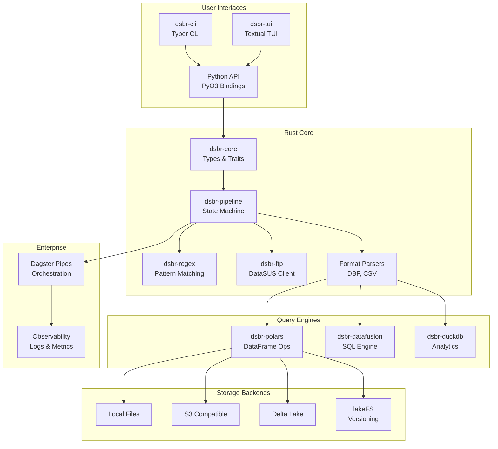
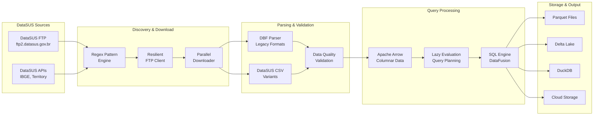

# DSBR Master Plan

## DataSUS for Brazil - Enterprise Data Processing Platform

### Table of Contents

- [DSBR Master Plan](#dsbr-master-plan)
  - [DataSUS for Brazil - Enterprise Data Processing Platform](#datasus-for-brazil---enterprise-data-processing-platform)
    - [Table of Contents](#table-of-contents)
  - [Project Overview](#project-overview)
    - [Key Features](#key-features)
  - [Architecture Diagrams](#architecture-diagrams)
    - [High-Level Architecture](#high-level-architecture)
    - [Data Processing Flow](#data-processing-flow)
    - [Crate Dependency Graph](#crate-dependency-graph)
  - [Project Structure](#project-structure)
    - [Complete Directory Tree](#complete-directory-tree)
  - [Technology Stack](#technology-stack)
    - [Core Technologies](#core-technologies)
    - [Data Processing](#data-processing)
    - [Enterprise Features](#enterprise-features)
    - [DataSUS-Specific](#datasus-specific)
    - [External Dependencies](#external-dependencies)
    - [PyO3 Binding Architecture](#pyo3-binding-architecture)
      - [Feature-Gated Binding Structure](#feature-gated-binding-structure)
      - [Unified API Pattern](#unified-api-pattern)
      - [Type Conversion Strategy](#type-conversion-strategy)
      - [Build Integration with Maturin](#build-integration-with-maturin)
      - [Advantages of Single Binding Layer](#advantages-of-single-binding-layer)
  - [DataSUS Pattern System](#datasus-pattern-system)
    - [File Naming Pattern Groups](#file-naming-pattern-groups)
    - [System to Prefix Mapping](#system-to-prefix-mapping)
    - [Pattern Examples](#pattern-examples)
    - [Geographic Codes (UF)](#geographic-codes-uf)
  - [Implementation Phases](#implementation-phases)
    - [Phase 1: Foundation (Weeks 1-2)](#phase-1-foundation-weeks-1-2)
      - [Goals](#goals)
      - [Deliverables](#deliverables)
      - [Success Criteria](#success-criteria)
    - [Phase 2: DataSUS Core (Weeks 3-4)](#phase-2-datasus-core-weeks-3-4)
      - [Goals](#goals-1)
      - [Deliverables](#deliverables-1)
      - [Success Criteria](#success-criteria-1)
    - [Phase 3: I/O \& Pipeline (Weeks 5-6)](#phase-3-io--pipeline-weeks-5-6)
      - [Goals](#goals-2)
      - [Deliverables](#deliverables-2)
      - [Success Criteria](#success-criteria-2)
    - [Phase 4: Advanced Formats (Weeks 7-8)](#phase-4-advanced-formats-weeks-7-8)
      - [Goals](#goals-3)
      - [Deliverables](#deliverables-3)
      - [Success Criteria](#success-criteria-3)
    - [Phase 5: Query Processing (Weeks 9-10)](#phase-5-query-processing-weeks-9-10)
      - [Goals](#goals-4)
      - [Deliverables](#deliverables-4)
      - [Success Criteria](#success-criteria-4)
    - [Phase 6: Storage \& Cloud (Weeks 11-12)](#phase-6-storage--cloud-weeks-11-12)
      - [Goals](#goals-5)
      - [Deliverables](#deliverables-5)
      - [Success Criteria](#success-criteria-5)
    - [Phase 7: Enterprise \& Interfaces (Weeks 13-16)](#phase-7-enterprise--interfaces-weeks-13-16)
      - [Goals](#goals-6)
      - [Deliverables](#deliverables-6)
      - [Success Criteria](#success-criteria-6)
  - [Development Workflow](#development-workflow)
    - [Initial Setup](#initial-setup)
    - [Daily Development Cycle](#daily-development-cycle)
    - [Release Process](#release-process)
    - [Available Just Targets](#available-just-targets)
  - [Usage Examples](#usage-examples)
    - [Python API](#python-api)
      - [Basic Usage](#basic-usage)
      - [Advanced Usage with SQL](#advanced-usage-with-sql)
      - [Streaming Large Datasets](#streaming-large-datasets)
      - [Integration with Dagster](#integration-with-dagster)
    - [CLI Usage](#cli-usage)
      - [Basic Commands](#basic-commands)
      - [Advanced CLI Features](#advanced-cli-features)
    - [Rust Usage](#rust-usage)
      - [Basic Rust API](#basic-rust-api)
      - [Advanced Rust Usage](#advanced-rust-usage)
    - [Configuration Examples](#configuration-examples)
      - [Job Configuration (TOML)](#job-configuration-toml)
      - [System Configuration (TOML)](#system-configuration-toml)
  - [Quality Assurance](#quality-assurance)
    - [Testing Strategy](#testing-strategy)
      - [Unit Tests](#unit-tests)
      - [Integration Tests](#integration-tests)
      - [End-to-End Tests](#end-to-end-tests)
      - [Performance Tests](#performance-tests)
    - [Code Quality Standards](#code-quality-standards)
      - [Rust Code Quality](#rust-code-quality)
      - [Python Code Quality](#python-code-quality)
    - [Continuous Integration](#continuous-integration)
      - [GitHub Actions Workflows](#github-actions-workflows)
    - [Documentation Standards](#documentation-standards)
      - [API Documentation](#api-documentation)
      - [User Documentation](#user-documentation)
      - [Architecture Documentation](#architecture-documentation)
    - [Release Process](#release-process-1)
      - [Version Management](#version-management)
      - [Release Pipeline](#release-pipeline)

---

## Project Overview

**DSBR (DataSUS for Brazil)** is a high-performance, enterprise-grade platform designed specifically for processing Brazilian health data from the DataSUS systems. Built with Rust for performance and Python for usability, DSBR provides a complete solution for healthcare data analysis, research, and reporting.

### Key Features

- **🚀 High Performance**: 10-100x faster than existing Python tools
- **🏗️ Enterprise Ready**: Dagster Pipes, lakeFS, observability
- **🇧🇷 Brazilian Focused**: Timezone handling, territorial data, regulatory compliance
- **🔌 Extensible**: Plugin architecture with feature flags
- **📊 Modern Stack**: Arrow, Polars, DataFusion, DuckDB
- **☁️ Cloud Native**: S3, Azure, GCP, Delta Lake support

---

## Architecture Diagrams

### High-Level Architecture



### Data Processing Flow



### Crate Dependency Graph

```mermaid
graph TD
    subgraph "Application Layer"
        CLI[dsbr-cli]
        TUI[dsbr-tui]
        PY_PKG[py-dsbr]
    end
    
    subgraph "Python Bindings"
        PY_BINDINGS[dsbr-python]
    end
    
    subgraph "Main Crate"
        MAIN[dsbr]
    end
    
    subgraph "Core Layer"
        CORE[dsbr-core]
        COMMON[dsbr-common]
        CONFIG[dsbr-config]
    end
    
    subgraph "Pipeline Layer"
        PIPELINE[dsbr-pipeline]
        ORCHESTRATOR[dsbr-orchestrator]
        REGEX[dsbr-regex]
    end
    
    subgraph "I/O Layer"
        FTP[dsbr-ftp]
        HTTP[dsbr-http]
        S3[dsbr-cloud-s3]
        AZURE[dsbr-cloud-azure]
        GCP[dsbr-cloud-gcp]
    end
    
    subgraph "Format Layer"
        FORMATS[dsbr-formats]
        DBF[dsbr-dbf]
        CSV_DATASUS[dsbr-csv-datasus]
    end
    
    subgraph "Query Layer"
        POLARS[dsbr-polars]
        DATAFUSION[dsbr-datafusion]
        DUCKDB[dsbr-duckdb]
    end
    
    subgraph "Transform Layer"
        TRANS_DATASUS[dsbr-transforms-datasus]
        TRANS_BRAZIL[dsbr-transforms-brazil]
    end
    
    subgraph "Storage Layer"
        STOR_LOCAL[dsbr-storage-local]
        STOR_S3[dsbr-storage-s3]
        STOR_DELTA[dsbr-storage-delta]
        LAKEFS[dsbr-lakefs]
    end
    
    subgraph "Enterprise Layer"
        DAGSTER[dsbr-dagster]
    end
    
    CLI --> PY_PKG
    TUI --> PY_PKG
    PY_PKG --> PY_BINDINGS
    PY_BINDINGS --> MAIN
    
    MAIN --> CORE
    MAIN --> PIPELINE
    MAIN --> FORMATS
    MAIN --> POLARS
    
    PIPELINE --> CORE
    PIPELINE --> COMMON
    PIPELINE --> CONFIG
    ORCHESTRATOR --> PIPELINE
    REGEX --> CORE
    
    FTP --> COMMON
    HTTP --> COMMON
    S3 --> COMMON
    
    FORMATS --> CORE
    DBF --> FORMATS
    CSV_DATASUS --> FORMATS
    
    POLARS --> CORE
    DATAFUSION --> CORE
    DUCKDB --> CORE
    
    TRANS_DATASUS --> CORE
    TRANS_BRAZIL --> CORE
    
    STOR_LOCAL --> CORE
    STOR_S3 --> COMMON
    STOR_DELTA --> CORE
    LAKEFS --> CORE
    
    DAGSTER --> CORE
```



---

## Project Structure

### Complete Directory Tree

```
dsbr/                                    # Root workspace
├── .github/                            # CI/CD workflows
│   ├── workflows/
│   │   ├── ci.yml                      # Continuous integration
│   │   ├── build-wheels.yml            # Python wheel building
│   │   ├── benchmarks.yml              # Performance benchmarks
│   │   └── docs.yml                    # Documentation deployment
│   └── dependabot.yml                  # Dependency updates
├── .cargo/                             # Cargo configuration
│   └── config.toml                     # Build settings
├── docs/                               # Documentation
│   ├── mkdocs.yml                      # MkDocs configuration with mkdocstrings
│   ├── requirements.txt                # Documentation dependencies
│   ├── index.md                        # Documentation home
│   ├── getting-started/
│   │   ├── installation.md
│   │   ├── quickstart.md
│   │   └── first-pipeline.md
│   ├── architecture/
│   │   ├── overview.md
│   │   ├── data-flow.md
│   │   └── patterns.md
│   ├── api/
│   │   ├── index.md                    # Auto-generated API index
│   │   ├── client.md                   # Generated from docstrings
│   │   ├── job.md                      # Generated from docstrings
│   │   ├── temporal.md                 # Generated from docstrings
│   │   └── transforms.md               # Generated from docstrings
│   ├── examples/
│   │   ├── basic-usage.md              # Links to API docs via genref
│   │   ├── advanced-queries.md         # Links to API docs via genref
│   │   ├── streaming.md                # Links to API docs via genref
│   │   └── dagster-integration.md      # Links to API docs via genref
│   └── reference/
│       ├── cli-commands.md
│       ├── configuration.md
│       └── troubleshooting.md
├── benchmarks/                         # Performance benchmarks
│   ├── Cargo.toml
│   ├── src/
│   │   ├── lib.rs
│   │   ├── datasus_processing.rs
│   │   └── comparison.rs
│   └── data/                           # Sample data for benchmarks
├── examples/                           # Usage examples
│   ├── rust/
│   │   ├── basic_pipeline.rs
│   │   ├── advanced_queries.rs
│   │   └── custom_transforms.rs
│   ├── python/
│   │   ├── basic_usage.py
│   │   ├── streaming_example.py
│   │   └── dagster_integration.py
│   └── data/                           # Sample DataSUS files
├── tests/                              # Integration tests
│   ├── fixtures/
│   │   ├── datasus_samples/
│   │   └── expected_outputs/
│   ├── rust/
│   │   ├── integration_tests.rs
│   │   └── end_to_end_tests.rs
│   └── python/
│       ├── test_integration.py
│       └── test_dagster_pipes.py
├── crates/                             # Rust crates (18 total, consolidated from 26)
│   ├── dsbr/                          # Main aggregator crate
│   │   ├── Cargo.toml                 # Feature flags configuration
│   │   ├── src/
│   │   │   ├── lib.rs                 # Re-exports and feature gates
│   │   │   └── prelude.rs             # Convenient imports
│   │   └── README.md
│   ├── dsbr-core/                     # Core types and traits
│   │   ├── Cargo.toml
│   │   └── src/
│   │       ├── lib.rs
│   │       ├── types/
│   │       │   ├── mod.rs
│   │       │   ├── job_spec.rs        # Job specifications
│   │       │   ├── temporal.rs        # Temporal scopes
│   │       │   ├── geographic.rs      # Geographic scopes
│   │       │   └── filters.rs         # Group filters
│   │       ├── traits/
│   │       │   ├── mod.rs
│   │       │   ├── parser.rs          # Format parser trait
│   │       │   ├── storage.rs         # Storage backend trait
│   │       │   └── transform.rs       # Transform trait
│   │       └── systems/
│   │           ├── mod.rs
│   │           └── datasus.rs         # DataSUS system definitions
│   ├── dsbr-common/                   # Shared utilities
│   │   ├── Cargo.toml
│   │   └── src/
│   │       ├── lib.rs
│   │       ├── errors/
│   │       │   ├── mod.rs
│   │       │   ├── pipeline.rs
│   │       │   ├── io.rs
│   │       │   └── format.rs
│   │       ├── utils/
│   │       │   ├── mod.rs
│   │       │   ├── encoding.rs        # Character encoding utilities
│   │       │   ├── compression.rs     # File compression handling
│   │       │   └── validation.rs      # Data validation utilities
│   │       └── macros.rs              # Utility macros
│   ├── dsbr-config/                   # Configuration management
│   │   ├── Cargo.toml
│   │   └── src/
│   │       ├── lib.rs
│   │       ├── job_config.rs          # Job configuration
│   │       ├── system_config.rs       # System configuration
│   │       ├── output_config.rs       # Output configuration
│   │       └── validation.rs          # Config validation
│   ├── dsbr-pipeline/                 # Pipeline state machine
│   │   ├── Cargo.toml
│   │   └── src/
│   │       ├── lib.rs
│   │       ├── state_machine.rs       # Core state machine
│   │       ├── states/
│   │       │   ├── mod.rs
│   │       │   ├── initialized.rs
│   │       │   ├── discovering.rs
│   │       │   ├── downloading.rs
│   │       │   ├── parsing.rs
│   │       │   ├── transforming.rs
│   │       │   ├── storing.rs
│   │       │   ├── completed.rs
│   │       │   └── failed.rs
│   │       ├── transitions.rs         # State transitions
│   │       ├── progress.rs            # Progress tracking
│   │       └── recovery.rs            # Error recovery
│   ├── dsbr-orchestrator/             # Pipeline coordination
│   │   ├── Cargo.toml
│   │   └── src/
│   │       ├── lib.rs
│   │       ├── coordinator.rs         # Pipeline coordinator
│   │       ├── scheduler.rs           # Job scheduling
│   │       ├── monitor.rs             # Progress monitoring
│   │       └── executor.rs            # Job execution
│   ├── dsbr-regex/                    # DataSUS regex patterns
│   │   ├── Cargo.toml
│   │   └── src/
│   │       ├── lib.rs
│   │       ├── builder.rs             # Pattern builder
│   │       ├── patterns/
│   │       │   ├── mod.rs
│   │       │   ├── groups.rs          # Pattern groups
│   │       │   ├── sia.rs             # SIA patterns
│   │       │   ├── sih.rs             # SIH patterns
│   │       │   ├── sinasc.rs          # SINASC patterns
│   │       │   ├── mortality.rs       # Mortality patterns
│   │       │   └── special_cases.rs   # CID, IBGE, etc.
│   │       ├── matcher.rs             # File matching engine
│   │       ├── validator.rs           # Pattern validation
│   │       └── registry.rs            # Pattern registry
│   ├── dsbr-formats/                  # Format detection
│   │   ├── Cargo.toml
│   │   └── src/
│   │       ├── lib.rs
│   │       ├── detector.rs            # Format detection
│   │       ├── metadata.rs            # File metadata
│   │       └── traits.rs              # Format traits
│   ├── dsbr-dbf/                      # DBF parser
│   │   ├── Cargo.toml
│   │   └── src/
│   │       ├── lib.rs
│   │       ├── parser.rs              # DBF parsing logic
│   │       ├── schema.rs              # Schema detection
│   │       ├── encoding.rs            # Character encoding
│   │       ├── types.rs               # DBF data types
│   │       └── arrow_convert.rs       # Arrow conversion
│   ├── dsbr-csv-datasus/             # DataSUS CSV variants
│   │   ├── Cargo.toml
│   │   └── src/
│   │       ├── lib.rs
│   │       ├── variants/
│   │       │   ├── mod.rs
│   │       │   ├── sim.rs             # SIM CSV format
│   │       │   ├── sinasc.rs          # SINASC CSV format
│   │       │   ├── sih.rs             # SIH CSV format
│   │       │   └── sia.rs             # SIA CSV format
│   │       ├── parser.rs              # CSV parsing logic
│   │       ├── schema_detection.rs    # Schema inference
│   │       └── validation.rs          # Data validation
│   ├── dsbr-ftp/                      # DataSUS FTP client
│   │   ├── Cargo.toml
│   │   └── src/
│   │       ├── lib.rs
│   │       ├── client.rs              # FTP client implementation
│   │       ├── discovery.rs           # File discovery
│   │       ├── download.rs            # File download
│   │       ├── retry.rs               # Retry logic
│   │       └── progress.rs            # Download progress
│   ├── dsbr-http/                     # HTTP client
│   │   ├── Cargo.toml
│   │   └── src/
│   │       ├── lib.rs
│   │       ├── client.rs              # HTTP client
│   │       ├── apis/
│   │       │   ├── mod.rs
│   │       │   ├── ibge.rs            # IBGE API client
│   │       │   └── territory.rs       # Territory API client
│   │       └── retry.rs               # HTTP retry logic
│   ├── dsbr-cloud/                   # Cloud storage integration (consolidated)
│   │   ├── Cargo.toml                 # Features: s3, azure, gcp
│   │   └── src/
│   │       ├── lib.rs                 # Feature-gated exports
│   │       ├── common/                # Shared cloud patterns
│   │       │   ├── mod.rs
│   │       │   ├── auth.rs            # Common authentication
│   │       │   ├── retry.rs           # Retry logic
│   │       │   ├── streaming.rs       # Streaming upload/download
│   │       │   └── credentials.rs     # Credential management
│   │       ├── s3/                    # S3 implementation
│   │       │   ├── mod.rs
│   │       │   ├── client.rs
│   │       │   └── operations.rs
│   │       ├── azure/                 # Azure Blob implementation
│   │       │   ├── mod.rs
│   │       │   ├── client.rs
│   │       │   └── operations.rs
│   │       └── gcp/                   # Google Cloud Storage
│   │           ├── mod.rs
│   │           ├── client.rs
│   │           └── operations.rs
│   ├── dsbr-polars/                  # Polars integration
│   │   ├── Cargo.toml
│   │   └── src/
│   │       ├── lib.rs
│   │       ├── conversion.rs          # Arrow <-> Polars
│   │       ├── operations.rs          # DataFrame operations
│   │       ├── lazy.rs                # Lazy evaluation
│   │       └── datasus_ops.rs         # DataSUS-specific ops
│   ├── dsbr-datafusion/              # DataFusion integration
│   │   ├── Cargo.toml
│   │   └── src/
│   │       ├── lib.rs
│   │       ├── context.rs             # SQL context
│   │       ├── functions/
│   │       │   ├── mod.rs
│   │       │   ├── datasus.rs         # DataSUS UDFs
│   │       │   └── brazil.rs          # Brazilian UDFs
│   │       ├── tables.rs              # Table providers
│   │       └── optimizer.rs           # Custom optimizations
│   ├── dsbr-duckdb/                  # DuckDB integration
│   │   ├── Cargo.toml
│   │   └── src/
│   │       ├── lib.rs
│   │       ├── engine.rs              # DuckDB engine wrapper
│   │       ├── extensions.rs          # DuckDB extensions
│   │       ├── analytics.rs           # Analytics functions
│   │       └── storage.rs             # Storage backend
│   ├── dsbr-transforms/              # Data transformations (consolidated)
│   │   ├── Cargo.toml                 # Features: datasus, brazil
│   │   └── src/
│   │       ├── lib.rs                 # Feature-gated exports
│   │       ├── common/                # Shared transformation patterns
│   │       │   ├── mod.rs
│   │       │   ├── traits.rs          # Transform traits
│   │       │   ├── pipeline.rs        # Transform pipeline
│   │       │   └── validation.rs      # Common validation patterns
│   │       ├── datasus/               # DataSUS-specific transformations
│   │       │   ├── mod.rs
│   │       │   ├── icd10.rs           # ICD-10 operations
│   │       │   ├── cnes.rs            # CNES operations
│   │       │   ├── territorial.rs     # Territory mapping
│   │       │   ├── validation.rs      # Data quality checks
│   │       │   └── standardization.rs # Data standardization
│   │       └── brazil/                # Brazilian-specific operations
│   │           ├── mod.rs
│   │           ├── timezones.rs       # Brazilian timezones
│   │           ├── holidays.rs        # Brazilian holidays
│   │           ├── geography.rs       # Geographic operations
│   │           ├── demographics.rs    # Demographic operations
│   │           └── validation/
│   │               ├── mod.rs
│   │               ├── cpf.rs         # CPF validation
│   │               ├── cnpj.rs        # CNPJ validation
│   │               └── postal.rs      # CEP validation
│   ├── dsbr-storage/                 # Storage backends (consolidated)
│   │   ├── Cargo.toml                 # Features: local, s3, delta
│   │   └── src/
│   │       ├── lib.rs                 # Feature-gated exports
│   │       ├── common/                # Shared storage patterns
│   │       │   ├── mod.rs
│   │       │   ├── traits.rs          # Storage backend traits
│   │       │   ├── partitioning.rs    # Common partitioning logic
│   │       │   ├── metadata.rs        # Metadata management
│   │       │   ├── indexing.rs        # File indexing
│   │       │   └── formats.rs         # File format handling
│   │       ├── local/                 # Local filesystem backend
│   │       │   ├── mod.rs
│   │       │   └── backend.rs
│   │       ├── s3/                    # S3 storage backend
│   │       │   ├── mod.rs
│   │       │   └── backend.rs
│   │       └── delta/                 # Delta Lake backend
│   │           ├── mod.rs
│   │           ├── backend.rs
│   │           ├── operations.rs      # Delta operations
│   │           ├── versioning.rs      # Version management
│   │           └── optimization.rs    # Table optimization
│   ├── dsbr-lakefs/                  # lakeFS integration
│   │   ├── Cargo.toml
│   │   └── src/
│   │       ├── lib.rs
│   │       ├── client.rs              # lakeFS client
│   │       ├── versioning.rs          # Data versioning
│   │       ├── branching.rs           # Branch management
│   │       ├── lineage.rs             # Data lineage
│   │       └── metadata.rs            # Metadata tracking
│   ├── dsbr-dagster/                 # Dagster Pipes integration
│   │   ├── Cargo.toml
│   │   └── src/
│   │       ├── lib.rs
│   │       ├── context.rs             # Pipes context
│   │       ├── messages.rs            # Message protocol
│   │       ├── logging.rs             # Logging integration
│   │       ├── metadata.rs            # Asset metadata
│   │       └── macros.rs              # Convenience macros
│   └── dsbr-python/                  # PyO3 bindings (single binding layer)
│       ├── Cargo.toml                 # Features mirror main crate features
│       └── src/
│           ├── lib.rs                 # Main Python module with feature gates
│           ├── client/                # Client API module
│           │   ├── mod.rs
│           │   ├── basic.rs           # Basic client operations
│           │   ├── streaming.rs       # Streaming operations
│           │   └── enterprise.rs      # Enterprise features (feature-gated)
│           ├── job_spec/              # Job specification module
│           │   ├── mod.rs
│           │   ├── core.rs            # Core job types
│           │   ├── temporal.rs        # Temporal scopes
│           │   ├── geographic.rs      # Geographic scopes
│           │   └── filters.rs         # Group filters
│           ├── results/               # Results and progress module
│           │   ├── mod.rs
│           │   ├── processing.rs      # Processing results
│           │   ├── progress.rs        # Progress tracking
│           │   └── metadata.rs        # Result metadata
│           ├── data/                  # Data access module (feature-gated)
│           │   ├── mod.rs
│           │   ├── polars_ops.rs      # Polars integration
│           │   ├── sql_engine.rs      # SQL operations
│           │   └── transforms.rs      # Data transformations
│           ├── storage/               # Storage module (feature-gated)
│           │   ├── mod.rs
│           │   ├── local.rs           # Local storage
│           │   ├── cloud.rs           # Cloud storage
│           │   └── delta.rs           # Delta Lake
│           ├── enterprise/            # Enterprise features (feature-gated)
│           │   ├── mod.rs
│           │   ├── dagster.rs         # Dagster Pipes integration
│           │   ├── lakefs.rs          # lakeFS operations
│           │   └── monitoring.rs      # Observability
│           ├── conversions.rs         # Type conversions between Rust/Python
│           ├── errors.rs              # Unified error handling
│           ├── callbacks.rs           # Progress callbacks and async support
│           └── utils.rs               # Python utilities and helpers
├── py-dsbr/                          # Python package
│   ├── pyproject.toml                # Python project configuration
│   ├── Cargo.toml                    # Maturin configuration
│   ├── Makefile                      # Python build commands
│   ├── README.md
│   ├── src/
│   │   └── dsbr/
│   │       ├── __init__.py           # Main Python API with comprehensive docstrings
│   │       ├── _dsbr.pyi             # Type stubs for Rust module
│   │       ├── client.py             # High-level client with Napoleon docstrings
│   │       ├── job.py                # Job specification with examples in docstrings
│   │       ├── config.py             # Configuration classes with type annotations
│   │       ├── types.py              # Data types (msgspec) with documentation
│   │       ├── temporal.py           # Temporal scope classes with usage examples
│   │       ├── geographic.py         # Geographic scope classes with examples
│   │       ├── filters.py            # Filter classes with detailed documentation
│   │       ├── results.py            # Result classes with field documentation
│   │       ├── exceptions.py         # Exception classes with error code documentation
│   │       ├── utils.py              # Utility functions with comprehensive examples
│   │       ├── testing.py            # Testing utilities with fixture documentation
│   │       └── py.typed               # PEP 561 type marker
│   ├── tests/
│   │   ├── __init__.py
│   │   ├── test_client.py
│   │   ├── test_job_spec.py
│   │   ├── test_temporal.py
│   │   ├── test_geographic.py
│   │   ├── test_integration.py
│   │   └── fixtures/
│   │       └── sample_data.py
│   └── docs/
│       ├── conf.py
│       ├── index.rst
│       ├── api.rst
│       └── examples.rst
├── dsbr-cli/                         # CLI application
│   ├── pyproject.toml
│   ├── README.md
│   └── src/
│       └── dsbr_cli/
│           ├── __init__.py
│           ├── main.py               # Main CLI entry point
│           ├── commands/
│           │   ├── __init__.py
│           │   ├── process.py        # Process command
│           │   ├── download.py       # Download command
│           │   ├── convert.py        # Convert command
│           │   ├── validate.py       # Validate command
│           │   └── info.py           # Info command
│           ├── config.py             # CLI configuration
│           ├── progress.py           # Progress display
│           ├── output.py             # Output formatting
│           └── utils.py              # CLI utilities
├── dsbr-tui/                         # TUI application
│   ├── pyproject.toml
│   ├── README.md
│   └── src/
│       └── dsbr_tui/
│           ├── __init__.py
│           ├── app.py                # Main TUI application
│           ├── widgets/
│           │   ├── __init__.py
│           │   ├── job_config.py     # Job configuration widget
│           │   ├── progress.py       # Progress display widget
│           │   ├── file_browser.py   # File browser widget
│           │   ├── data_preview.py   # Data preview widget
│           │   └── logs.py           # Logs display widget
│           ├── screens/
│           │   ├── __init__.py
│           │   ├── main.py           # Main screen
│           │   ├── config.py         # Configuration screen
│           │   ├── monitor.py        # Monitoring screen
│           │   └── results.py        # Results screen
│           └── utils.py              # TUI utilities
├── Cargo.toml                        # Root workspace configuration
├── Cargo.lock                        # Dependency lock file
├── uv.toml                           # UV workspace configuration
├── uv.lock                           # Python dependency lock
├── rust-toolchain.toml               # Rust toolchain specification
├── Makefile                          # Development commands
├── README.md                         # Project README
├── LICENSE                           # License file
├── CHANGELOG.md                      # Change log
├── CONTRIBUTING.md                   # Contribution guidelines
├── .gitignore                        # Git ignore rules
├── .gitattributes                    # Git attributes
├── dprint.json                       # Code formatting configuration
└── rustfmt.toml                      # Rust formatting configuration
```

---

## Technology Stack

### Core Technologies

| Component | Technology | Purpose | Benefits |
|-----------|------------|---------|----------|
| **Core Runtime** | Rust | High-performance processing | Memory safety, zero-cost abstractions, concurrency |
| **Python Bindings** | PyO3 | Python integration | Native performance with Python usability |
| **Data Format** | Apache Arrow | Columnar data | Zero-copy operations, interoperability |
| **Package Manager** | uv | Python dependencies | 10-100x faster than pip, unified workspaces |
| **Build System** | maturin | Rust-Python builds | Seamless Rust-Python integration |

### Data Processing

| Component | Technology | Purpose | Benefits |
|-----------|------------|---------|----------|
| **DataFrame Operations** | Polars | Data manipulation | Lazy evaluation, high performance, expressive API |
| **SQL Engine** | DataFusion | Query processing | Vectorized execution, cost-based optimization |
| **Analytics Database** | DuckDB | OLAP queries | Native Rust client, analytical workloads |
| **Serialization** | msgspec | High-speed serialization | 25x faster than JSON, type safety |
| **Time Handling** | Whenever | Brazilian timezones | DST-safe operations, timezone accuracy |

### Enterprise Features

| Component | Technology | Purpose | Benefits |
|-----------|------------|---------|----------|
| **Orchestration** | Dagster Pipes | Workflow management | Enterprise scheduling, observability |
| **Data Versioning** | lakeFS | Version control for data | Git-like operations, data lineage |
| **Cloud Storage** | Object stores | Scalable storage | S3, Azure Blob, Google Cloud Storage |
| **Data Lake** | Delta Lake | ACID transactions | Time travel, schema evolution |

### DataSUS-Specific

| Component | Technology | Purpose | Benefits |
|-----------|------------|---------|----------|
| **File Patterns** | Regex engine | File discovery | Handles complex DataSUS naming patterns |
| **DBC Decompression** | datasus-dbc crate | DBC file handling | Proven DataSUS compression support |
| **DBF Parsing** | dbase crate | DBF file parsing | Robust legacy format support |
| **FTP Client** | suppaftp + async-rustls | DataSUS server access | Async FTP with TLS support |
| **Brazilian Operations** | Domain logic | Timezone, geographic, validation | Compliance with Brazilian regulations |

### External Dependencies

| Category | Crate | Version | Purpose |
|----------|-------|---------|---------|
| **Data Processing** | arrow | ~53.0 | Columnar data format |
| | polars | ~0.41 | DataFrame operations |
| | datafusion | ~41.0 | SQL query engine |
| | duckdb | ~0.10 | Analytics database |
| **Async Runtime** | tokio | ~1.35 | Async runtime |
| | async-trait | ~0.1 | Async traits |
| **HTTP/FTP** | reqwest | ~0.12 | HTTP client |
| | suppaftp | ~6.3 | Async FTP with TLS |
| **DataSUS Formats** | datasus-dbc | ~latest | DBC decompression |
| | dbase | ~0.6 | DBF parsing |
| **Serialization** | serde | ~1.0 | Data serialization |
| | msgspec | Python only | High-speed serialization |
| **Time/Date** | chrono | ~0.4 | Date/time operations |
| | whenever | Python only | Brazilian timezones |
| **Cloud SDKs** | aws-sdk-s3 | ~1.9 | S3 integration |
| | azure_storage | ~0.19 | Azure Blob storage |
| | google-cloud-storage | ~0.16 | GCS integration |
| **Python Bindings** | pyo3 | ~0.25 | Python integration (single binding layer) |
| | maturin | ~1.7 | Build system with workspace support |

*Note: Versions updated on each release cycle for stability*

### PyO3 Binding Architecture

**Single Binding Layer Design:**
- **Centralized API**: Single `dsbr-python` crate exposing unified Python interface
- **Feature Gates**: Conditional compilation based on enabled Rust features
- **Type Coherence**: Consistent type conversions and error handling throughout
- **User Experience**: Single `import dsbr` covers entire functionality
- **Ecosystem Pattern**: Follows successful PyO3 projects (Polars, Pydantic, etc.)

#### Feature-Gated Binding Structure

```rust
// dsbr-python/Cargo.toml
[features]
default = ["basic"]
basic = ["dsbr/basic"]
cloud = ["dsbr/cloud", "basic"]
enterprise = ["dsbr/enterprise", "cloud"]
full = ["enterprise"]

[dependencies]
pyo3 = { version = "~0.25", features = ["extension-module"] }
dsbr = { path = "../dsbr" }
```

```rust
// dsbr-python/src/lib.rs - Main Python module
use pyo3::prelude::*;

#[pymodule]
fn _dsbr(m: &Bound<'_, PyModule>) -> PyResult<()> {
    // Core functionality (always available)
    m.add_class::<client::Client>()?;
    m.add_class::<job_spec::Job>()?;
    m.add_class::<results::Result>()?;
    
    // Feature-gated functionality
    #[cfg(feature = "cloud")]
    {
        m.add_class::<storage::CloudStorage>()?;
        m.add_function(wrap_pyfunction!(storage::configure_s3, m)?)?;
    }
    
    #[cfg(feature = "enterprise")]
    {
        m.add_class::<enterprise::DagsterPipes>()?;
        m.add_class::<enterprise::LakeFSClient>()?;
    }
    
    Ok(())
}
```

#### Unified API Pattern

```python
# Single import covers all functionality
import dsbr

# Basic usage (always available)
client = dsbr.Client()
job = dsbr.Job(system="SIH", temporal_scope=dsbr.TemporalScope.year(2023))

# Cloud features (if compiled with cloud feature)
if hasattr(dsbr, 'CloudStorage'):
    storage = dsbr.CloudStorage.s3("my-bucket")
    job.with_storage(storage)

# Enterprise features (if compiled with enterprise feature)
if hasattr(dsbr, 'DagsterPipes'):
    pipes = dsbr.DagsterPipes.from_env()
    result = client.run(job, observability=pipes)
```

#### Type Conversion Strategy

```rust
// dsbr-python/src/conversions.rs - Centralized type conversions
use pyo3::prelude::*;
use dsbr_core::{JobSpec, TemporalScope, GeographicScope};

// Consistent conversion patterns across all types
impl FromPyObject<'_> for JobSpec {
    fn extract(ob: &PyAny) -> PyResult<Self> {
        let system: String = ob.getattr("system")?.extract()?;
        let temporal: TemporalScope = ob.getattr("temporal_scope")?.extract()?;
        let geographic: GeographicScope = ob.getattr("geographic_scope")?.extract()?;
        
        Ok(JobSpec {
            system,
            temporal_scope: temporal,
            geographic_scope: geographic,
            // ... other fields
        })
    }
}

// Unified error conversion
impl From<dsbr_common::DSBRError> for PyErr {
    fn from(err: dsbr_common::DSBRError) -> Self {
        match err {
            DSBRError::Connection(_) => PyConnectionError::new_err(err.to_string()),
            DSBRError::Validation(_) => PyValueError::new_err(err.to_string()),
            DSBRError::Processing(_) => PyRuntimeError::new_err(err.to_string()),
            // ... consistent error mapping
        }
    }
}
```

#### Build Integration with Maturin

```toml
# py-dsbr/Cargo.toml - Maturin configuration
[build-system]
requires = ["maturin>=1.7,<2.0"]
build-backend = "maturin"

[project]
name = "dsbr"
description = "High-performance DataSUS data processing for Python"
requires-python = ">=3.8"
classifiers = [
    "Programming Language :: Rust",
    "Programming Language :: Python :: Implementation :: CPython",
    "Programming Language :: Python :: Implementation :: PyPy",
]

[project.optional-dependencies]
cloud = []        # Cloud storage features
enterprise = []   # Enterprise orchestration features
full = []         # All features enabled

[tool.maturin]
path = "../crates/dsbr-python"
module-name = "dsbr._dsbr"
features = ["basic"]  # Default feature set

# Feature profiles for different distributions
[tool.maturin.profile.cloud]
features = ["cloud"]

[tool.maturin.profile.enterprise]
features = ["enterprise"]

[tool.maturin.profile.full]
features = ["full"]
```

#### Advantages of Single Binding Layer

**1. User Experience**
```python
# Clean, unified API
import dsbr

# Everything accessible through single namespace
client = dsbr.Client()
job = dsbr.Job(...)
result = client.run(job)
dataframe = dsbr.read_datasus_ftp("SIH", 2023)
```

**2. Type Safety & Consistency**
- Single source of truth for Python type definitions
- Consistent error handling across all operations
- Unified async/await patterns
- Coherent callback interfaces

**3. Documentation & Discoverability**
- Single module documentation
- Coherent help system: `help(dsbr)`
- IDE autocompletion works seamlessly
- Unified example patterns

**4. Performance Optimization**
- Centralized type conversion optimization
- Reduced Python-Rust boundary crossings
- Efficient memory management patterns
- Streamlined callback mechanisms

**5. Maintenance Benefits**
- Single test suite for Python integration
- Centralized compatibility management
- Unified release process
- Easier dependency updates

---

## DataSUS Pattern System

### File Naming Pattern Groups

DataSUS files follow specific naming conventions grouped by format structure:

```rust
enum DataSUSPatternGroup {
    // [group(2-10)][UF(2)][year(2)] - Most hospital/ambulatory systems
    GroupUF2Year,    // SIA, SIH, CNES, SISCOLO, SISMAMA
    
    // [group(2-10)][UF(2)][year(4)] - Birth/mortality systems  
    GroupUF4Year,    // SINASC, PO, DO
    
    // [group(2-10)][UF(2)][year(2)] - Surveillance systems
    GroupUF2YearAlt, // PCE, PNI, RESP, IBGE, SINAN
    
    // [group(2-10)][year(2)] - National files (no UF)
    GroupYear,       // DOINF, DOFET, DOEXT, DOMAT, DOEXRT
    
    // Special cases
    CIDChapters,     // CID01.DBF, CID02.DBF (disease classifications)
    IBGEQuery,       // URL-based IBGE API queries
    TerritoryData,   // MUNIC2022.DBF, UF2022.DBF (geographic data)
    Alertadengue,    // Dengue surveillance
    ESUS,            // e-SUS primary care data
}
```

### System to Prefix Mapping

| System | Prefixes | File Example | Description |
|--------|----------|--------------|-------------|
| **SIA** | PA, PS, AC, AD | `PASP2312.DBF` | Ambulatory Information System |
| **SIH** | RD, SP, ER, RJ | `RDSP2312.DBC` | Hospital Information System |
| **CNES** | LT, ST, DC, EQ | `LTSP2312.DBF` | National Health Facilities Registry |
| **SINASC** | DN | `DNSP2023.DBF` | Live Birth Information System |
| **DO** | DO | `DOSP2023.DBF` | Mortality Information System |
| **DOINF** | DOINF | `DOINF2312.DBF` | Infant Mortality (national) |

### Pattern Examples

```
Hospital Data (SIH):
- RDSP2312.DBC  # Reduced records, São Paulo, Dec 2023
- SPSP2312.DBC  # Service records, São Paulo, Dec 2023  
- ERSP2312.DBC  # Error records, São Paulo, Dec 2023

Ambulatory Data (SIA):
- PASP2312.DBF  # Production, São Paulo, Dec 2023
- PSSP2312.DBF  # Psychosocial, São Paulo, Dec 2023

Birth Data (SINASC):
- DNSP2023.DBF  # Births, São Paulo, 2023
- DNSP202312.DBF # Births, São Paulo, Dec 2023

Mortality Data (DO):
- DOSP2023.DBF   # Deaths, São Paulo, 2023
- DOSP202312.DBF # Deaths, São Paulo, Dec 2023
```

### Geographic Codes (UF)

| State | Code | State | Code | State | Code |
|-------|------|-------|------|-------|------|
| AC | 12 | AL | 17 | AP | 16 |
| AM | 13 | BA | 29 | CE | 23 |
| DF | 53 | ES | 32 | GO | 52 |
| MA | 21 | MT | 51 | MS | 50 |
| MG | 31 | PA | 15 | PB | 25 |
| PR | 41 | PE | 26 | PI | 22 |
| RJ | 33 | RN | 24 | RS | 43 |
| RO | 11 | RR | 14 | SC | 42 |
| SP | 35 | SE | 28 | TO | 27 |

---

## Implementation Phases

### Phase 1: Foundation (Weeks 1-2)

#### Goals

- Establish rock-solid foundation for all other crates
- Core types, traits, and error handling
- Configuration management system

#### Deliverables

**Core Infrastructure:**
- [ ] `dsbr-core`: Types, traits, system definitions, Arrow integration
- [ ] `dsbr-common`: Error handling, utilities, macros, logging
- [ ] `dsbr-config`: Configuration management, validation, TOML support

#### Success Criteria

- Stable foundation APIs that other crates can depend on
- Comprehensive error handling with proper error chains
- Configuration system supports all planned features
- 100% test coverage for core functionality
- Documentation complete for public APIs

---

### Phase 2: DataSUS Core (Weeks 3-4)

#### Goals

- Basic DataSUS functionality using proven external crates
- File pattern recognition and format detection
- DBF/DBC parsing foundation

#### Deliverables

**DataSUS Integration:**
- [ ] `dsbr-regex`: Pattern matching engine for all DataSUS file groups
- [ ] `dsbr-formats`: Format detection and metadata extraction
- [ ] `dsbr-dbf`: DBF parser using `dbase` crate + Arrow conversion
- [ ] DBC decompression using `datasus-dbc` crate

#### Success Criteria

- Can discover files using regex patterns across all DataSUS systems
- Can parse DBF files to Arrow format reliably
- DBC decompression working for hospital data
- Format detection handles all major DataSUS variants

---

### Phase 3: I/O & Pipeline (Weeks 5-6)

#### Goals

- Data acquisition from DataSUS servers
- Basic processing pipeline
- End-to-end file processing capability

#### Deliverables

**I/O Systems:**
- [ ] `dsbr-ftp`: FTP client using `suppaftp` with async-rustls
- [ ] `dsbr-http`: HTTP clients for IBGE/territory APIs
- [ ] `dsbr-pipeline`: State machine for processing workflows

#### Success Criteria

- Reliable FTP downloads from DataSUS servers
- Basic end-to-end processing: discover → download → parse → output
- Pipeline state machine handles errors and recovery
- Progress tracking and logging throughout pipeline

---

### Phase 4: Advanced Formats (Weeks 7-8)

#### Goals

- Complete format support for all DataSUS systems
- CSV variant handling
- Data quality validation

#### Deliverables

**Format Enhancement:**
- [ ] `dsbr-csv-datasus`: CSV variants for SIM, SINASC, SIH, SIA
- [ ] Enhanced schema inference and validation
- [ ] Data quality checks and error reporting

#### Success Criteria

- Process all major DataSUS file formats (DBF, DBC, CSV variants)
- Reliable file discovery across all pattern groups
- Robust data validation and quality reporting
- Complete format coverage for healthcare data

---

### Phase 5: Query Processing (Weeks 9-10)

#### Goals

- Data transformation and query capabilities
- DataSUS-specific operations
- Brazilian regulatory compliance

#### Deliverables

**Query & Transform:**
- [ ] `dsbr-polars`: DataFrame operations with lazy evaluation
- [ ] `dsbr-datafusion`: SQL processing with DataSUS UDFs
- [ ] `dsbr-transforms`: Consolidated transforms (datasus + brazil features)
  - ICD-10, CNES, territorial operations
  - Brazilian timezones, holidays, CPF/CNPJ validation

#### Success Criteria

- Rich data processing with Polars DataFrames
- SQL queries work on DataSUS data with domain-specific functions
- Brazilian compliance operations (timezones, validation)
- Comprehensive transformation capabilities

---

### Phase 6: Storage & Cloud (Weeks 11-12)

#### Goals

- Flexible output options
- Cloud storage integration
- Production-ready data backends

#### Deliverables

**Storage Systems:**
- [ ] `dsbr-storage`: Consolidated storage (local, s3, delta features)
- [ ] `dsbr-cloud`: Consolidated cloud (s3, azure, gcp features)
- [ ] Multiple output formats and partitioning strategies

#### Success Criteria

- Flexible output to local files, cloud storage, Delta Lake
- Seamless cloud integration with major providers
- Optimized partitioning and storage layouts
- Production-ready performance and reliability

---

### Phase 7: Enterprise & Interfaces (Weeks 13-16)

#### Goals

- Production deployment readiness
- User interfaces and Python bindings
- Enterprise orchestration

#### Deliverables

**Enterprise Features:**
- [ ] `dsbr-lakefs`: Data versioning and lineage
- [ ] `dsbr-dagster`: Dagster Pipes integration
- [ ] `dsbr-orchestrator`: Advanced workflow management

**User Interfaces:**
- [ ] `dsbr-python`: PyO3 bindings with comprehensive API
- [ ] `dsbr-cli`: Command-line interface (Python + Typer)
- [ ] `dsbr-tui`: Terminal user interface (Python + Textual)
- [ ] Complete Python package with documentation

#### Success Criteria

- Full enterprise orchestration with Dagster
- Complete data versioning and lineage tracking
- Professional CLI and TUI applications
- Production-ready Python API with comprehensive documentation
- Ready for enterprise deployment

---

## Development Workflow

### Initial Setup

```bash
# Clone and setup the workspace
git clone https://github.com/your-org/dsbr
cd dsbr

# Install development dependencies
uv sync --all-extras

# Build Rust components
just install

# Verify installation
dsbr --version
dsbr-tui --help
```

### Daily Development Cycle

```bash
# Start development session
just dev-setup          # Setup development environment

# Code development
just build              # Debug build (fast compilation)
just test               # Run all tests
just test-rust          # Rust-only tests  
just test-python        # Python-only tests
just lint               # Code quality checks
just fmt                # Format code

# Feature development
cargo build --features "minimal,dbf,ftp"
cargo test -p dsbr-dbf
uv run --package dsbr-cli -- dsbr process --help

# Before commit
just check-all          # Full quality checks
just docs               # Update documentation
```

### Release Process

```bash
# Prepare release
just version-bump       # Update version numbers
just changelog          # Update changelog
just build-release      # Release builds

# Testing
just test-integration   # Integration tests
just test-e2e          # End-to-end tests
just benchmark         # Performance tests

# Distribution
just build-wheels      # Python wheels
just publish          # Publish to PyPI/crates.io

# Documentation
just docs-deploy      # Deploy documentation
```

### Available Just Targets

| Target | Description |
|--------|-------------|
| `just install` | Build and install development version |
| `just build` | Debug build (fast compilation) |
| `just build-release` | Optimized release build |
| `just build-dist-release` | Maximum optimization build |
| `just test` | Run all tests (Rust + Python) |
| `just test-rust` | Run Rust tests only |
| `just test-python` | Run Python tests only |
| `just test-integration` | Integration tests |
| `just benchmark` | Performance benchmarks |
| `just lint` | Code linting (clippy + ruff) |
| `just fmt` | Code formatting |
| `just docs` | Build documentation |
| `just clean` | Clean build artifacts |

---

## Usage Examples

### Python API

#### Basic Usage

```python
import dsbr
from datetime import date

# Initialize client
client = dsbr.Client()

# Simple job configuration
job = dsbr.Job(
    system="SIH",
    temporal_scope=dsbr.TemporalScope.month(2023, 6),
    geographic_scope=dsbr.GeographicScope.states(["SP", "RJ"]),
    group_filters=[
        dsbr.GroupFilter.age_group(min_age=65),
        dsbr.GroupFilter.disease_group(["I20-I25"])  # Cardiac diseases
    ]
)

# Execute job
result = client.run(job)
print(f"Processed {result.record_count} records")
print(f"Output saved to: {result.output_path}")
```

#### Advanced Usage with SQL

```python
import dsbr

# Read DataSUS data directly into DataFrame
df = (dsbr.read_datasus_ftp("SIH", 2023)
      .sql("""
          SELECT 
              SUBSTR(MUNIC_RES, 1, 2) as state,
              COUNT(*) as hospitalizations,
              AVG(CAST(IDADE AS INT)) as avg_age,
              DIAG_PRINC as primary_diagnosis
          FROM self 
          WHERE CAST(IDADE AS INT) >= 65
          GROUP BY state, primary_diagnosis
          ORDER BY hospitalizations DESC
      """)
      .collect())

# Brazilian-specific operations
df_enhanced = (df
               .datasus.with_territorial_info()  # Add municipality names, regions
               .datasus.with_icd10_names()       # Add disease descriptions
               .brazil.with_holidays()           # Add Brazilian holiday info
               )

# Save results
df_enhanced.write_parquet("elderly_hospitalizations_2023.parquet")
```

#### Streaming Large Datasets

```python
import dsbr

# Process data in streaming fashion for memory efficiency
job = dsbr.Job(
    system="SIM",  # Mortality data
    temporal_scope=dsbr.TemporalScope.year(2023),
    geographic_scope=dsbr.GeographicScope.national(),
    streaming=True,  # Enable streaming mode
    batch_size=10000  # Process in batches
)

# Stream processing with callbacks
def on_progress(batch_num, total_batches, records_processed):
    print(f"Batch {batch_num}/{total_batches}: {records_processed} records")

def on_batch(batch_df):
    # Process each batch
    return (batch_df
            .filter(dsbr.col("age") > 0)
            .datasus.with_icd10_names()
            .select(["state", "municipality", "age", "cause_of_death", "date"]))

result = client.run_streaming(
    job,
    on_progress=on_progress,
    on_batch=on_batch,
    output_format="delta"  # Delta Lake for ACID transactions
)
```

#### Integration with Dagster

```python
import dagster as dg
import dsbr

@dg.asset
def datasus_mortality_data(
    context: dg.AssetExecutionContext,
    pipes_subprocess_client: dg.PipesSubprocessClient
) -> None:
    """Process DataSUS mortality data with full observability."""
    
    return pipes_subprocess_client.run(
        command=[
            "dsbr", "process",
            "--system", "SIM",
            "--year", "2023",
            "--geographic-scope", "states:SP,RJ,MG",
            "--group-filters", "age-group:65+",
            "--output-format", "delta",
            "--output-path", "s3://datalake/datasus/mortality/",
            "--with-dagster-pipes"  # Enable Dagster integration
        ],
        context=context,
    ).get_results()

@dg.asset(deps=[datasus_mortality_data])
def mortality_analysis_report(context: dg.AssetExecutionContext) -> None:
    """Generate mortality analysis report from processed data."""
    
    # Use DSBR's analytics capabilities
    analysis = dsbr.Analytics.load("s3://datalake/datasus/mortality/")
    
    report = (analysis
              .aggregate_by_region()
              .calculate_mortality_rates()  
              .generate_insights()
              .export_report("mortality_analysis_2023.pdf"))
    
    context.log.info(f"Report generated: {report.path}")
    return report
```

### CLI Usage

#### Basic Commands

```bash
# Process DataSUS data
dsbr process \
    --system SIH \
    --temporal-scope month:2023-06 \
    --geographic-scope states:SP,RJ \
    --group-filters age-group:65+ \
    --output-format parquet \
    --output-path ./processed_data/

# Download data only (no processing)
dsbr download \
    --system SIA \
    --year 2023 \
    --states SP,RJ,MG \
    --output-dir ./raw_data/

# Convert between formats
dsbr convert \
    --input ./raw_data/RDSP2312.DBC \
    --output ./converted/rdsp_dec2023.parquet \
    --format parquet

# Validate DataSUS files
dsbr validate \
    --path ./raw_data/ \
    --system SIH \
    --report validation_report.html
```

#### Advanced CLI Features

```bash
# Stream processing for large datasets
dsbr process \
    --system SIM \
    --year 2023 \
    --streaming \
    --batch-size 50000 \
    --memory-limit 4GB \
    --parallel-workers 4

# SQL queries on DataSUS data
dsbr query \
    --data-path ./processed_data/sim_2023.parquet \
    --sql "SELECT state, COUNT(*) FROM data WHERE age > 65 GROUP BY state" \
    --output-format csv

# Cloud deployment
dsbr process \
    --system SIH \
    --year 2023 \
    --storage s3 \
    --s3-bucket datalake-datasus \
    --s3-prefix processed/sih/2023/ \
    --with-lakefs \
    --branch feature/new-analysis

# Integration with external systems
dsbr process \
    --system SIA \
    --year 2023 \
    --with-dagster-pipes \
    --dagster-run-id $DAGSTER_RUN_ID \
    --output-metadata-to-dagster
```

### Rust Usage

#### Basic Rust API

```rust
use dsbr::prelude::*;
use tokio;

#[tokio::main]
async fn main() -> Result<(), Box<dyn std::error::Error>> {
    // Configure job
    let job = JobSpec::builder()
        .system("SIH")
        .temporal_scope(TemporalScope::month(2023, 6))
        .geographic_scope(GeographicScope::states(vec!["SP", "RJ"]))
        .group_filters(vec![
            GroupFilter::age_group(Some(65), None),
            GroupFilter::disease_group(vec!["I20-I25".to_string()])
        ])
        .output_config(OutputConfig::parquet("./output/"))
        .build();

    // Execute pipeline
    let mut pipeline = Pipeline::new(job);
    let results = pipeline.run().await?;

    println!("Processing completed:");
    println!("  Records processed: {}", results.record_count);
    println!("  Files generated: {}", results.output_files.len());
    println!("  Duration: {:?}", results.duration);

    Ok(())
}
```

#### Advanced Rust Usage

```rust
use dsbr::prelude::*;
use dsbr_dagster::DSBRPipesContext;

#[tokio::main]
async fn main() -> Result<(), Box<dyn std::error::Error>> {
    // Initialize with Dagster Pipes if available
    let mut dagster_ctx = DSBRPipesContext::try_init();
    
    if let Some(ref mut ctx) = dagster_ctx {
        ctx.log_info("Starting DataSUS processing with enterprise features");
    }

    // Configure advanced pipeline
    let job = JobSpec::builder()
        .system("SIM")
        .temporal_scope(TemporalScope::quarter(2023, 2))
        .geographic_scope(GeographicScope::health_regions(vec!["SP01", "SP02"]))
        .group_filters(vec![
            GroupFilter::gender(vec![Gender::Female]),
            GroupFilter::age_group(Some(15), Some(49))
        ])
        .transformations(vec![
            Transformation::datasus("add_icd10_names"),
            Transformation::brazil("add_territorial_info"),
            Transformation::custom_sql(r#"
                SELECT *,
                       CASE WHEN age BETWEEN 15 AND 19 THEN 'Teen pregnancy'
                            WHEN age BETWEEN 20 AND 34 THEN 'Optimal age'
                            ELSE 'Advanced maternal age' END as risk_category
                FROM data
            "#)
        ])
        .storage(StorageConfig::delta_lake("s3://datalake/maternal_mortality/"))
        .with_lakefs(LakeFSConfig {
            repository: "datasus-analysis".to_string(),
            branch: "maternal-health-q2-2023".to_string(),
        })
        .build();

    // Execute with monitoring
    let mut pipeline = Pipeline::new(job);
    
    // Add progress callback
    pipeline.on_progress(|stage, progress| {
        if let Some(ref mut ctx) = dagster_ctx {
            ctx.log_info(&format!("Stage {}: {:.1}% complete", stage, progress * 100.0));
        }
        println!("Stage {}: {:.1}% complete", stage, progress * 100.0);
    });

    // Run pipeline
    let results = pipeline.run().await?;

    // Report results to Dagster
    if let Some(ref mut ctx) = dagster_ctx {
        ctx.report_datasus_processing(
            "SIM", 
            2023, 
            results.record_count,
            &results.output_path
        );
    }

    Ok(())
}
```

### Configuration Examples

#### Job Configuration (TOML)

```toml
# job_config.toml
[job]
id = "maternal_mortality_analysis_q2_2023"
name = "Q2 2023 Maternal Mortality Analysis"
description = "Analysis of maternal mortality data for Q2 2023"

[job.system]
name = "SIM"
version = "latest"

[job.temporal_scope]
type = "quarter"
year = 2023
quarter = 2

[job.geographic_scope]
type = "health_regions"
regions = ["SP01", "SP02", "RJ01"]

[[job.group_filters]]
type = "gender"
values = ["Female"]

[[job.group_filters]]
type = "age_group"
min_age = 15
max_age = 49

[[job.group_filters]]
type = "disease_group"
values = ["O00-O99"]  # Pregnancy, childbirth complications

[job.transformations]
add_icd10_names = true
add_territorial_info = true
add_demographic_data = true

[job.output]
format = "delta"
path = "s3://datalake/maternal_mortality/"
partitioning = ["year", "quarter", "state"]

[job.enterprise]
dagster_pipes = true
lakefs_enabled = true
lakefs_repository = "datasus-analysis"
lakefs_branch = "maternal-health-q2-2023"
```

#### System Configuration (TOML)

```toml
# dsbr_config.toml
[datasus]
ftp_base_url = "ftp2.datasus.gov.br"
http_base_url = "https://datasus.saude.gov.br"
download_timeout = 300
max_concurrent_downloads = 5
retry_attempts = 3

[storage]
default_backend = "local"
cache_directory = "~/.cache/dsbr"
temp_directory = "/tmp/dsbr"

[storage.s3]
region = "us-east-1"
bucket = "datalake-datasus"
prefix = "processed/"

[processing]
default_batch_size = 100000
memory_limit = "8GB"
enable_streaming = true
parallel_workers = 4

[enterprise]
dagster_pipes_enabled = true
lakefs_enabled = true
observability_enabled = true

[logging]
level = "info"
format = "json"
output = "stdout"
```

---

## Quality Assurance

### Testing Strategy

#### Unit Tests

- **Coverage Target**: 90%+ for all crates
- **Focus Areas**: Core logic, data transformations, error handling
- **Tools**: `cargo test`, property-based testing with `proptest`

```bash
# Run unit tests
cargo test                              # All Rust tests
cargo test -p dsbr-dbf                  # Specific crate tests
uv run pytest tests/python/            # Python tests

# Coverage reporting
cargo tarpaulin --out Html              # Rust coverage
uv run pytest --cov=dsbr tests/        # Python coverage
```

#### Integration Tests

- **Scope**: Cross-crate functionality, Python-Rust integration
- **Data**: Real DataSUS samples and synthetic test data
- **Scenarios**: End-to-end pipelines, error recovery, performance

```bash
# Integration tests
just test-integration                   # All integration tests
cargo test --test integration          # Rust integration
uv run pytest tests/integration/       # Python integration
```

#### End-to-End Tests

- **Pipelines**: Complete DataSUS processing workflows
- **Systems**: All supported DataSUS systems (SIM, SINASC, SIH, SIA, etc.)
- **Environments**: Local, cloud, with/without enterprise features

```bash
# End-to-end tests
just test-e2e                          # Full E2E test suite
just test-e2e-cloud                    # Cloud-based E2E tests
just test-e2e-enterprise               # Enterprise feature tests
```

#### Performance Tests

- **Benchmarks**: Compare against existing tools (pandas, R packages)
- **Scalability**: Large dataset processing, memory usage
- **Regression**: Prevent performance regressions

```bash
# Performance tests
cargo bench                            # Rust benchmarks
just benchmark                         # Full benchmark suite
just benchmark-comparison              # vs. existing tools
```

### Code Quality Standards

#### Rust Code Quality

- **Linting**: `clippy` with strict settings
- **Formatting**: `rustfmt` with project configuration
- **Documentation**: All public APIs documented
- **Safety**: `#![deny(unsafe_code)]` where possible

```bash
# Quality checks
cargo clippy -- -D warnings            # Strict linting
cargo fmt --check                      # Format checking
cargo doc --no-deps                    # Documentation build
```

#### Python Code Quality  

- **Type Checking**: `mypy` with strict configuration
- **Linting**: `ruff` for fast linting and formatting
- **Import Sorting**: `isort` integration
- **Security**: `bandit` security linting

```bash
# Python quality checks
uv run mypy src/dsbr/                  # Type checking
uv run ruff check src/                 # Linting
uv run ruff format src/                # Formatting
uv run bandit -r src/                  # Security scan
```

### Continuous Integration

#### GitHub Actions Workflows

**.github/workflows/ci.yml**

```yaml
name: CI

on: [push, pull_request]

jobs:
  rust-tests:
    runs-on: ubuntu-latest
    steps:
      - uses: actions/checkout@v4
      - uses: dtolnay/rust-toolchain@stable
      - uses: Swatinem/rust-cache@v2
      - run: cargo test --all-features
      - run: cargo clippy -- -D warnings

  python-tests:
    runs-on: ubuntu-latest
    strategy:
      matrix:
        python-version: ["3.8", "3.9", "3.10", "3.11", "3.12"]
    steps:
      - uses: actions/checkout@v4
      - uses: astral-sh/setup-uv@v1
      - run: uv sync --python ${{ matrix.python-version }}
      - run: uv run pytest

  integration-tests:
    runs-on: ubuntu-latest
    steps:
      - uses: actions/checkout@v4
      - run: just test-integration

  benchmarks:
    runs-on: ubuntu-latest
    steps:
      - uses: actions/checkout@v4
      - run: just benchmark
      - uses: benchmark-action/github-action-benchmark@v1
        with:
          tool: 'cargo'
          output-file-path: target/criterion/report/index.html
```

### Documentation Standards

#### API Documentation

- **Rust**: `rustdoc` with examples for all public APIs
- **Python**: Napoleon-style docstrings with comprehensive type hints
- **Auto-Generation**: mkdocstrings with genref for seamless API integration
- **Cross-References**: mkdocstrings Insiders features for relative refs and example linking
- **Coverage**: 100% of public APIs documented with live examples

#### User Documentation  

- **MkDocs**: Material theme with mkdocstrings and advanced navigation
- **API Integration**: Auto-generated API docs with genref cross-referencing
- **Content**: Getting started, tutorials, live API reference, linked examples
- **Features**:
  - Cross-references between examples and docstrings
  - Type annotations with hover documentation
  - Code examples that link directly to API documentation
  - Search with API function/class discovery
- **Deployment**: Automated deployment to GitHub Pages with mkdocstrings Insiders

**MkDocs Configuration Example:**

```yaml
# docs/mkdocs.yml
site_name: DSBR - DataSUS for Brazil
theme:
  name: material
  features:
    - content.code.annotate
    - content.tabs.link
    - navigation.sections
    - navigation.top
    - search.suggest
    - search.highlight
    - search.share

plugins:
  - search
  - mkdocstrings:
      enabled: !ENV [ENABLE_MKDOCSTRINGS, true]
      custom_templates: templates
      default_handler: python
      handlers:
        python:
          options:
            docstring_style: napoleon
            docstring_options:
              ignore_init_summary: true
            merge_init_into_class: true
            show_submodules: true
            show_source: true
            show_bases: true
            show_inheritance_diagram: true
            group_by_category: true
            heading_level: 2
  - gen-files:
      scripts:
        - docs/gen_ref_pages.py
  - literate-nav:
      nav_file: SUMMARY.md
  - section-index

nav:
  - Home: index.md
  - Getting Started:
    - Installation: getting-started/installation.md
    - Quick Start: getting-started/quickstart.md
    - First Pipeline: getting-started/first-pipeline.md
  - Examples:
    - Basic Usage: examples/basic-usage.md
    - Advanced Queries: examples/advanced-queries.md
    - Streaming: examples/streaming.md
    - Dagster Integration: examples/dagster-integration.md
  - API Reference: reference/
  - Architecture:
    - Overview: architecture/overview.md
    - Data Flow: architecture/data-flow.md
    - Patterns: architecture/patterns.md
  - Reference:
    - CLI Commands: reference/cli-commands.md
    - Configuration: reference/configuration.md
    - Troubleshooting: reference/troubleshooting.md

markdown_extensions:
  - admonition
  - pymdownx.details
  - pymdownx.superfences
  - pymdownx.tabbed:
      alternate_style: true
  - pymdownx.highlight:
      anchor_linenums: true
  - pymdownx.inlinehilite
  - pymdownx.snippets
  - toc:
      permalink: true

extra:
  social:
    - icon: fontawesome/brands/github
      link: https://github.com/your-org/dsbr
```

**Napoleon Docstring Example:**

```python
# src/dsbr/client.py
from typing import Optional, List, Union
from datetime import date
import dsbr

class Client:
    """High-level client for DataSUS data processing.
    
    The DSBR client provides a simple interface for processing Brazilian
    health data from DataSUS systems with enterprise-grade performance
    and reliability.
    
    Examples:
        Basic client usage:
        
        ```python
        import dsbr
        
        client = dsbr.Client()
        job = dsbr.Job(
            system="SIH", 
            temporal_scope=dsbr.TemporalScope.year(2023)
        )
        result = client.run(job)
        ```
        
        For more examples, see [Basic Usage][basic-usage] and 
        [Advanced Queries][advanced-queries].
    
    Note:
        The client automatically handles connection pooling, retry logic,
        and progress tracking. See [`run`][dsbr.Client.run] for details.
    
    Attributes:
        config (ClientConfig): Client configuration settings.
        is_connected (bool): Whether client is connected to DataSUS servers.
    """
    
    def run(
        self,
        job: "Job",
        *,
        progress_callback: Optional[callable] = None,
        streaming: bool = False
    ) -> "Result":
        """Execute a DataSUS processing job.
        
        This method orchestrates the complete data processing pipeline:
        file discovery, download, parsing, transformation, and storage.
        
        Args:
            job: Job specification defining what data to process.
                See [`Job`][dsbr.Job] for configuration options.
            progress_callback: Optional callback for progress updates.
                Called with signature `(stage: str, progress: float)`.
            streaming: Whether to use streaming mode for large datasets.
                Reduces memory usage but may be slower for small jobs.
        
        Returns:
            Processing results including record counts, output paths,
            and performance metrics. See [`Result`][dsbr.Result].
            
        Raises:
            ConnectionError: If DataSUS servers are unreachable.
            ValidationError: If job configuration is invalid.
            ProcessingError: If data processing fails.
            
        Examples:
            Process hospital data for São Paulo:
            
            ```python
            job = dsbr.Job(
                system="SIH",
                temporal_scope=dsbr.TemporalScope.month(2023, 6),
                geographic_scope=dsbr.GeographicScope.states(["SP"])
            )
            result = client.run(job)
            print(f"Processed {result.record_count} records")
            ```
            
            Process with progress tracking:
            
            ```python
            def on_progress(stage, progress):
                print(f"{stage}: {progress:.1%}")
                
            result = client.run(job, progress_callback=on_progress)
            ```
            
            For streaming large datasets:
            
            ```python
            result = client.run(job, streaming=True)
            ```
        
        See Also:
            - [`run_streaming`][dsbr.Client.run_streaming]: For streaming workflows
            - [`validate_job`][dsbr.Client.validate_job]: For job validation
            - [Streaming Examples][streaming]: Complete streaming examples
        """
        pass
```

**genref Cross-Reference Example:**

```markdown
<!-- docs/examples/basic-usage.md -->
# Basic Usage

This guide shows you how to get started with DSBR for processing DataSUS data.

## Quick Start

First, create a [`Client`][dsbr.Client] instance:

\```python
import dsbr

client = dsbr.Client()
\```

Then configure a [`Job`][dsbr.Job] to specify what data you want:

\```python
job = dsbr.Job(
    system="SIH",  # Hospital Information System
    temporal_scope=dsbr.TemporalScope.year(2023),
    geographic_scope=dsbr.GeographicScope.states(["SP", "RJ"])
)
\```

Finally, run the job using [`Client.run`][dsbr.Client.run]:

\```python
result = client.run(job)
print(f"Processed {result.record_count} records")
print(f"Files saved to: {result.output_path}")
\```

## Configuration Options

The [`Job`][dsbr.Job] class supports various configuration options:

- [`temporal_scope`][dsbr.Job.temporal_scope]: Time range selection
- [`geographic_scope`][dsbr.Job.geographic_scope]: Geographic filtering  
- [`group_filters`][dsbr.Job.group_filters]: Data filtering criteria

For complete details, see the [Job API reference][dsbr.Job].
```

#### Architecture Documentation

- **ADRs**: Architecture Decision Records for major decisions
- **Diagrams**: Mermaid diagrams for system architecture
- **Runbooks**: Operational procedures and troubleshooting

```bash
# Documentation commands
just docs                              # Build all documentation (MkDocs + rustdoc)
just docs-serve                       # Serve docs locally with hot reload
just docs-deploy                      # Deploy to GitHub Pages with mkdocstrings Insiders
just docs-api-gen                     # Generate API docs with mkdocstrings genref
just docs-link-check                  # Check all cross-references and example links
```

### Release Process

#### Version Management

- **Semantic Versioning**: Strict adherence to SemVer
- **Coordinated Releases**: All crates released together
- **Changelog**: Automated changelog generation

#### Release Pipeline

```bash
# Prepare release
just version-bump minor                # Bump version
just changelog                        # Update changelog
git commit -am "Release v0.2.0"
git tag v0.2.0

# Build and test
just build-release                    # Release builds
just test-all                        # Full test suite
just benchmark                       # Performance validation

# Publish
cargo publish -p dsbr-core           # Publish Rust crates
uv build && uv publish              # Publish Python package
git push && git push --tags         # Push release
```

This comprehensive master plan provides a complete roadmap for developing DSBR as a world-class platform for Brazilian health data processing, with enterprise capabilities and exceptional performance.
