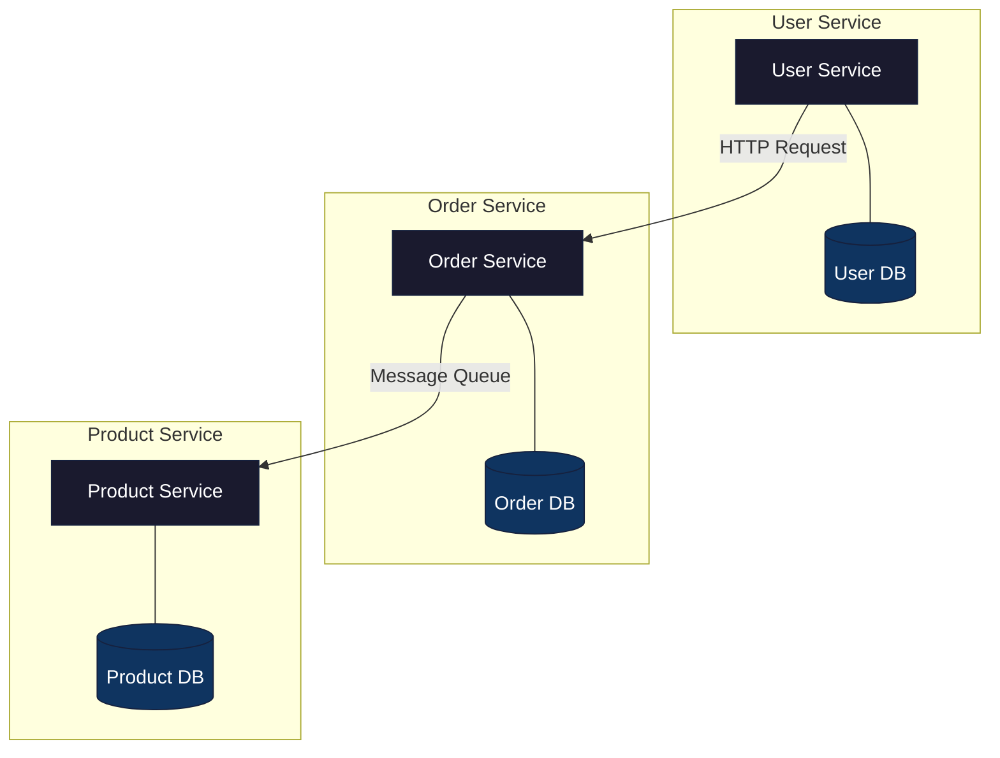
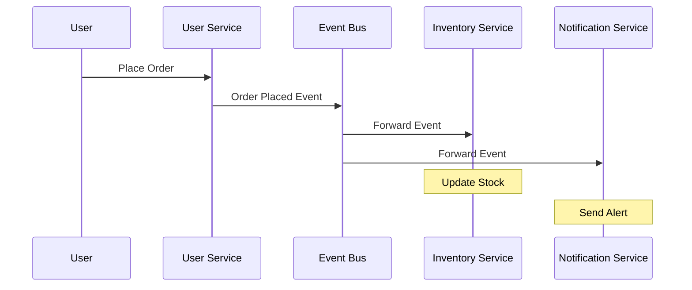
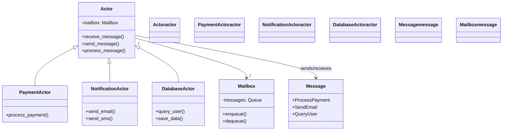
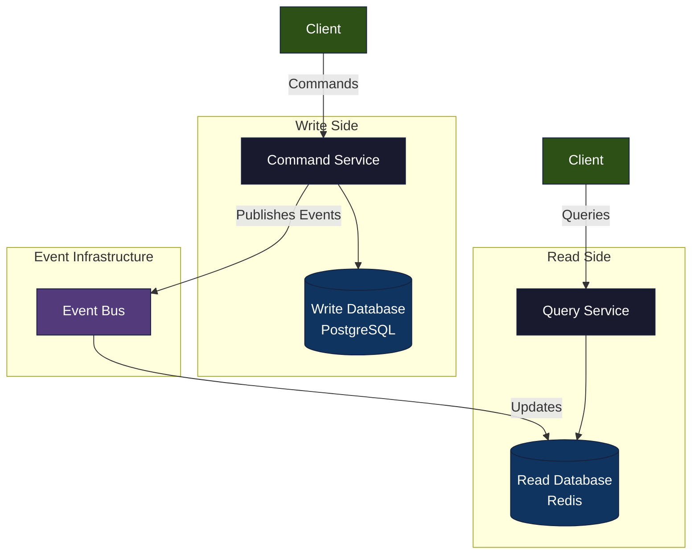
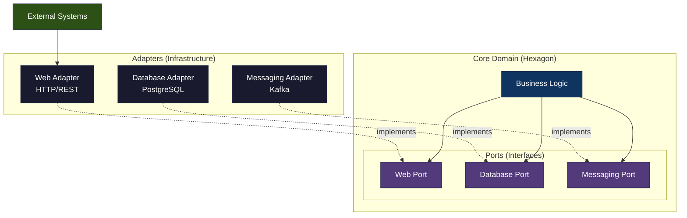

# Building Big with Rust: 5 Architecture Patterns You'll Actually Love

Alright, let's talk. If you're diving into backend development today, you're probably not just thinking about getting something working, right? You're dreaming bigger.

*Image used under fair use. Sourced from Google. Not owned by the author.*

You want your creation to handle a million users, process mountains of data, and churn through requests without breaking. That's where architecture patterns come in — they're like your secret weapon, proven ways to build software that's not just good, but great at handling growth.

And Rust? Oh man, Rust is quickly becoming the rockstar of backend languages. It's ridiculously fast, super safe with memory (meaning fewer sneaky bugs!), and incredibly good at juggling multiple tasks at once.

But even with Rust's superpowers, truly scaling your system means picking the right blueprint for how all your code fits together.

So, let's pull back the curtain and chat about five killer architecture patterns that just click with Rust, helping you build backends that can grow right alongside your biggest ambitions.

## 1. Microservices Architecture: Divide and Conquer (the Good Kind!)

So, what's this pattern all about? Imagine you've got a massive Lego castle. Instead of trying to build the whole thing in one go, you build smaller, independent sections: the tower, the drawbridge, the main hall.

That's microservices! You break your big application down into many tiny, self-contained services. Each one does just one specific job — like handling all your users, or processing every single order, or managing your product catalog. These little services chat with each other using simple ways, usually through web APIs or by sending messages back and forth.

**Why Rust loves this pattern for scaling:** Rust's blazing speed and its tiny memory footprint make it an absolute champ for individual microservices.

Think about it: you can cram more of these Rust-powered mini-apps onto fewer machines. Plus, Rust's built-in safety checks are like having a super-smart editor catching mistakes before your code even runs, which is a total lifesaver in systems where tons of tiny parts are talking to each other. And with async/await, Rust handles loads of requests inside each service super efficiently – no sweat.



### Code Example: Simple Service Entry Point

Here's a peek at what the code might do (a simplified service entry point):

Think of the main.rs file for a small "user-service" you're building with a web framework like Axum:

```rust
// Inside your 'user-service' project folder:

fn main() {
    // First things first, we'd fire up our database connection pool.
    // And get our logging set up so we can see what's going on.
    // ...

    // Next, we'd map out all the web addresses (routes) for user stuff –
    // like '/users' to get everyone, or '/users/{id}' for a specific person.
    // Each of these routes would point to an 'async' function that does the actual work.

    // Finally, we tell our server to start listening for requests
    // on a specific address and port, say "127.0.0.1:8001".
}

// And inside one of those functions, let's say 'get_user_by_id':
async fn get_user_by_id(user_id: u32) -> Result<User, SomeErrorType> {
    // This is where we'd fetch the user's details from *our* database.
    // Something like: `our_db_client.fetch_user(user_id).await;`
    // Then, we'd send that user data back.
    Ok(User { /* ... */ }) // Just imagine this is the user's info!
}
```

---

## 2. Event-Driven Architecture (EDA): When Things Happen, Let Everyone Know

So, what's this pattern all about? Instead of services constantly calling each other directly, they communicate by shouting out "events" when something important happens.

Imagine a customer places an order — that's an "order placed" event. One service publishes this event to a central "event bus" (think of it like a town crier). Any other service that cares about "order placed" events listens in and reacts. This keeps everyone from being too tangled up, which is fantastic for flexibility.

**Why Rust loves this pattern for scaling:** Rust's sheer speed is a godsend for processing huge amounts of events. And its stellar support for concurrent programming means it's super straightforward to build services that can both pump out events like crazy and gobble them up in parallel. Libraries for big event systems like Kafka or RabbitMQ play really nicely with Rust.



### Code Example: Event Sender/Receiver

Here's a peek at what the code might do (conceptual event sender/receiver):

Imagine a Rust piece of code that describes an event and then sends it out:

```rust
// First, we create a blueprint for our "Order Placed" event.
struct OrderPlaced {
    order_id: String,
    user_id: String,
    items: Vec<String>,
}

// Now, a function that actually sends this event out into the world.
async fn publish_order_placed(event: OrderPlaced) {
    // We'd use a special library here (like 'rdkafka' for Kafka)
    // to send our 'event' to the right "topic" or "queue."
    // It's like putting a letter in a specific mailbox for anyone subscribed to that kind of letter.
    // Example: `producer.send_message("order_topic", &event.to_json_string()).await;`
}

// And then, a completely separate service that listens for these events:
async fn start_event_consumer() {
    // This service would first connect to that central message hub.
    // Then, it'd say: "Hey, I wanna hear about all 'order_placed_topic' events!"
    // It would then constantly wait for new messages to arrive:
    // `while let Some(message) = consumer.next_message().await {`
    // Once it gets a message, it turns it back into our 'OrderPlaced' event.
    // And then, it does its specific job, like updating inventory or sending a confirmation email.
    // `println!("Just got an order for: {}", order_event.order_id);`
}
```

---

## 3. Actor Model: Little Workers, Safe Conversations

So, what's this pattern all about? Think of "actors" as tiny, super-focused workers, each with their own desk and filing cabinet. They work independently, and the only way they talk to each other is by sending little messages. Each actor processes messages one by one, which completely sidesteps those frustrating problems where different parts of your code try to mess with the same data at the same time.

**Why Rust loves this pattern for scaling:** Rust's unique system for managing who owns what data (ownership and borrowing) is a natural fit for preventing nasty concurrency bugs right from the start. While Rust doesn't force you into an Actor Model, its async/await features and built-in message channels (mpsc) are perfect tools to build systems that act a lot like actors – safe and super efficient at passing messages around.



### Code Example: Simple Counter Actor

Here's a peek at what the code might do (a simple counter actor):

Imagine building a basic actor in Rust that just keeps track of a number:

```rust
use tokio::sync::{mpsc, oneshot};

// First, we define what kinds of messages our little actor can understand.
enum MyActorMessage {
    Increment, // "Add one to your number!"
    Decrement, // "Subtract one from your number!"
    // This one is special: "Tell me your current number, and here's where to send the answer back."
    GetValue(oneshot::Sender<i32>),
}

// Now, our actor itself. It holds its number and a way to get messages.
struct MyActor {
    value: i32,
    receiver: mpsc::Receiver<MyActorMessage>,
}

impl MyActor {
    // How to create a new actor. We give it its message receiver.
    fn new(receiver: mpsc::Receiver<MyActorMessage>) -> Self {
        MyActor { value: 0, receiver }
    }

    // This is the actor's main job – it just keeps listening for messages.
    async fn run(&mut self) {
        // It keeps going as long as there are messages to process.
        while let Some(msg) = self.receiver.recv().await {
            match msg {
                MyActorMessage::Increment => self.value += 1,
                MyActorMessage::Decrement => self.value -= 1,
                MyActorMessage::GetValue(response_sender) => {
                    // If someone asked for the value, we send it back!
                    let _ = response_sender.send(self.value); // We ignore errors if the sender disappeared.
                }
            }
        }
    }
}

// How you'd start this actor and chat with it:
#[tokio::main]
async fn main() {
    // We set up a "channel" – like a direct pipeline for messages.
    let (sender, receiver) = mpsc::channel(32);

    // Create our actor and give it the receiving end of the channel.
    let mut actor = MyActor::new(receiver);
    // And tell Rust to run our actor in the background as its own little task.
    tokio::spawn(async move { actor.run().await });

    // Now, let's send it some commands!
    sender.send(MyActorMessage::Increment).await.unwrap();
    sender.send(MyActorMessage::Increment).await.unwrap();

    // And then, ask it what its number is.
    let (response_tx, response_rx) = oneshot::channel();
    sender.send(MyActorMessage::GetValue(response_tx)).await.unwrap();
    let current_value = response_rx.await.unwrap();
    // If all went well, 'current_value' should be 2!
    println!("Actor's current value: {}", current_value);
}
```

---

## 4. CQRS (Command Query Responsibility Segregation): Read This Way, Write That Way

So, what's this pattern all about? This is a smart way to cleanly separate how you change data (like "create a new user" — that's a Command) from how you read data (like "show me all users" — that's a Query). Often, this means you might even use totally different ways to store the data, with one part optimized for super-fast writing and another for lightning-quick reading.

**Why Rust loves this pattern for scaling:** Rust's sheer performance absolutely shines when you're dealing with lots of data flow.

You can tweak your "write" path (Commands) for maximum speed and your "read" path (Queries) for incredibly fast retrieval, even using different databases if it makes sense. Rust's efficiency means you squeeze the most out of both sides.



### Code Example: Command/Query Handlers

Here's a peek at what the code might do (conceptual command/query handlers):

Imagine you have two separate Rust files, one just for handling commands (changes) and one just for queries (reads):

```rust
// Inside a 'commands.rs' file (for making changes to your data)
pub struct CreateUserCommand { /* all the juicy details to create a user */ }

pub async fn handle_create_user_command(cmd: CreateUserCommand) -> Result<(), SomeError> {
    // First, we'd double-check if the command makes sense.
    // Then, we'd save the new user's data to our special 'write' database.
    // And here's the crucial part: we'd publish an event like "UserCreated"
    // so other parts of the system know about the new user.
    // Example: `write_db_client.insert_user(...).await;`
    // `event_publisher.publish(UserCreatedEvent { ... }).await;`
    Ok(())
}

// Inside a 'queries.rs' file (for just getting data)
pub struct GetUserByIdQuery { user_id: String }

pub async fn handle_get_user_by_id_query(query: GetUserByIdQuery) -> Result<UserDisplayModel, SomeError> {
    // This is where we'd fetch data from our 'read-optimized' database.
    // This database is specifically set up to give us answers super fast for displaying info.
    // Example: `read_db_client.query_user_for_display(query.user_id).await;`
    Ok(UserDisplayModel { /* ... this is the data you'd show on screen */ })
}
```

---

## 5. Hexagonal Architecture (Ports and Adapters): Your Core Logic, Protected and Flexible

So, what's this pattern all about? Think of it like building your application with a super clear, protective shell around its heart. Your core business logic — the unique stuff that makes your app tick — lives safe in the middle. This core defines "ports" (which are just interfaces or contracts) for how it wants to talk to the outside world, like databases, user interfaces, or other services. Then, "adapters" are built specifically to plug into these ports, connecting your core to the actual outside technologies you're using.

**Why Rust loves this pattern for scaling:** Rust's trait system (which is exactly how you define interfaces) is absolutely perfect for creating these "ports." This architecture makes your backend incredibly easy to test and adapt. Want to ditch PostgreSQL for something else? Just build a new adapter, and your core business logic won't even bat an eye. That kind of flexibility is pure gold when you need to scale by swapping out parts of your infrastructure.



### Code Example: Trait and Implementation

Here's a peek at what the code might do (conceptual trait and implementation):

Imagine a Rust blueprint (trait) for how we save and find users, and then a concrete way to actually do it with PostgreSQL:

```rust
// In a 'domain' or 'core' part of your code (this is inside the protected hexagon)
pub trait UserRepository {
    // This defines *WHAT* we can do with user data (find, save), not *HOW* we do it.
    fn find_by_id(&self, id: &str) -> Result<Option<User>, SomeError>;
    fn save(&self, user: User) -> Result<(), SomeError>;
}

pub struct User { /* User's name, email, etc. */ }
pub struct SomeError; // A simple way to handle errors

// In a 'persistence' or 'infrastructure' part of your code (this is an adapter)
pub struct PostgresUserRepository {
    // This would hold your actual database connection pool.
}

// Now, we tell Rust that our 'PostgresUserRepository' knows how to fulfill
// all the promises defined in the 'UserRepository' trait.
impl UserRepository for PostgresUserRepository {
    fn find_by_id(&self, id: &str) -> Result<Option<User>, SomeError> {
        // Here's where the actual SQL query happens,
        // using a library like 'sqlx' or 'diesel' to talk to PostgreSQL.
        // Example: `sqlx::query_as!(User, "SELECT * FROM users WHERE id = $1", id).fetch_optional(&self.pool).await;`
        Ok(None) // Just a placeholder for now
    }
    fn save(&self, user: User) -> Result<(), SomeError> {
        // And here's where we'd write to the database to save the user's data.
        Ok(()) // Placeholder
    }
}
```

---

## Bringing It All Together

Look, picking the right way to build your backend isn't just about cranking out code; it's about setting yourself up for wins in the long run. It totally impacts how easily your system can grow, how simple it is to fix things when they go sideways, and how reliably it keeps chugging along, even when things get hectic.

Rust, with its amazing speed, rock-solid concurrency features, and built-in safety nets, gives you an incredible foundation. When you pair that pure power with these battle-tested architectural blueprints, you're not just building a backend — you're crafting a masterpiece that's ready to handle anything you throw at it.

So go on, build something amazing. Rust and these patterns are absolutely here to help you scale your dreams!
